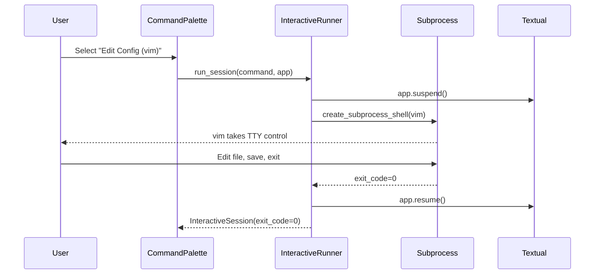

# Data Model: TUI Interactive Shell Commands

**Feature**: 002-tui-interactive-shell  
**Date**: 2026-01-24  
**Status**: Draft

## Overview

This document defines the data structures needed to support interactive shell sessions within the ops deck TUI. These models extend the existing command execution framework to handle full TTY handoff and terminal state management.

---

## Core Entities

### 1. InteractiveSession

Represents a single interactive command execution with TTY control.

**Purpose**: Track lifecycle and state of interactive processes (vim, bash, tmux) that take full terminal control.

**Attributes**:

| Field | Type | Required | Description | Validation |
|-------|------|----------|-------------|------------|
| `session_id` | `str` (UUID) | Yes | Unique identifier for this session | UUID v4 format |
| `command` | `str` | Yes | Full shell command executed (e.g., "vim file.txt") | Non-empty string |
| `session_type` | `SessionType` | Yes | Category of interactive session | Enum: SHELL, EDITOR, MULTIPLEXER |
| `pid` | `int` or `None` | No | Process ID of the subprocess (set when running) | Positive integer or None |
| `exit_code` | `int` or `None` | No | Exit code after session completes | 0-255 or None if running |
| `start_time` | `datetime` | Yes | When the session started | ISO 8601 timestamp |
| `end_time` | `datetime` or `None` | No | When the session ended | ISO 8601 timestamp, None if running |
| `working_directory` | `str` | Yes | Working directory before session started | Valid directory path |
| `environment_snapshot` | `dict[str, str]` | Yes | Copy of environment variables at session start | Key-value pairs |
| `error_log` | `list[str]` | Yes | Errors/exceptions logged during session | Empty list if no errors |
| `logging_enabled` | `bool` | Yes | Whether full I/O logging is enabled for this session | Default: False |
| `log_file_path` | `str` or `None` | No | Path to session log file (if logging_enabled) | Valid file path or None |

**State Transitions**:
```
CREATED → RUNNING → COMPLETED
         ↓
       FAILED (if subprocess crashes before handoff)
```

**Relationships**:
- Extends existing `Execution` model pattern (similar structure for consistency)
- References `Command` model (command definition from YAML config)

**Example**:
```python
InteractiveSession(
    session_id="a3f2b1c4-5678-9012-3456-789012345678",
    command="vim /etc/config.yaml",
    session_type=SessionType.EDITOR,
    pid=12345,
    exit_code=None,  # Still running
    start_time=datetime(2026, 1, 24, 10, 30, 0),
    end_time=None,
    working_directory="/home/user/ops",
    environment_snapshot={"PATH": "/usr/bin", "HOME": "/home/user"},
    error_log=[],
    logging_enabled=False,
    log_file_path=None
)
```

---

### 2. SessionType (Enum)

Categorizes interactive sessions for logging and UI display.

**Purpose**: Distinguish between different types of interactive processes for metrics and debugging.

**Values**:

| Value | Description | Example Commands |
|-------|-------------|------------------|
| `SHELL` | Interactive shell sessions | bash, zsh, fish, sh |
| `EDITOR` | Text editors with full-screen UI | vim, nano, emacs, micro |
| `MULTIPLEXER` | Terminal multiplexers | tmux, screen |
| `OTHER` | Any other interactive tool | python REPL, gdb, htop |

**Usage**:
```python
from enum import Enum

class SessionType(str, Enum):
    SHELL = "shell"
    EDITOR = "editor"
    MULTIPLEXER = "multiplexer"
    OTHER = "other"
```

---

### 3. InteractiveCommand (Extension)

Extends existing `Command` model to mark commands as interactive.

**Purpose**: Differentiate interactive commands (requiring TTY handoff) from standard async commands.

**New Attributes** (added to existing `Command` model):

| Field | Type | Required | Description | Default |
|-------|------|----------|-------------|---------|
| `interactive` | `bool` | No | Whether this command requires TTY control | `False` |
| `session_type` | `SessionType` or `None` | No | Type of interactive session (if interactive=True) | Auto-detect from command or `None` |

**Auto-Detection Logic**:
```python
def detect_session_type(command: str) -> SessionType:
    """Auto-detect session type from command string."""
    cmd_lower = command.lower()
    
    if any(shell in cmd_lower for shell in ["bash", "zsh", "sh", "fish"]):
        return SessionType.SHELL
    elif any(editor in cmd_lower for editor in ["vim", "nano", "emacs", "micro"]):
        return SessionType.EDITOR
    elif any(mux in cmd_lower for mux in ["tmux", "screen"]):
        return SessionType.MULTIPLEXER
    else:
        return SessionType.OTHER
```

**Example YAML Configuration**:
```yaml
commands:
  - name: "Edit Config"
    command: "vim config.yaml"
    description: "Edit configuration file in vim"
    interactive: true
    # session_type: auto-detected as EDITOR
  
  - name: "Open Shell"
    command: "bash"
    description: "Open interactive bash shell"
    interactive: true
    # session_type: auto-detected as SHELL
  
  - name: "Check Disk Space"
    command: "df -h"
    description: "Show disk usage"
    # interactive: false (default, runs async)
```

---

### 4. TerminalState (Internal)

Captures terminal state for edge case restoration (if Textual's `suspend()`/`resume()` insufficient).

**Purpose**: Backup terminal settings for manual restoration if subprocess crashes.

**Attributes**:

| Field | Type | Description |
|-------|------|-------------|
| `termios_attrs` | `list[Any]` | Result of `termios.tcgetattr()` |
| `cursor_visible` | `bool` | Cursor visibility state |
| `raw_mode` | `bool` | Whether terminal is in raw mode |

**Note**: This is an internal model used only by `InteractiveRunner`. Not exposed to UI layer.

---

## Data Flow



---

## Validation Rules

### InteractiveSession Validation

1. **Command non-empty**: `len(command.strip()) > 0`
2. **Exit code range**: `0 <= exit_code <= 255` (if not None)
3. **Time consistency**: `end_time > start_time` (if end_time is not None)
4. **Log file required if logging enabled**: `if logging_enabled: log_file_path is not None`
5. **Working directory exists**: `os.path.isdir(working_directory)`

### InteractiveCommand Validation

1. **Session type required if interactive**: `if interactive: session_type is not None`
2. **Interactive commands must not be async-only**: Cannot have both `interactive=True` and `async_only=True`

---

## Integration with Existing Models

### Command Model (src/models/command.py)

**Existing structure**:
```python
@dataclass
class Command:
    name: str
    command: str
    description: str = ""
```

**Extended with**:
```python
@dataclass
class Command:
    name: str
    command: str
    description: str = ""
    interactive: bool = False  # NEW
    session_type: SessionType | None = None  # NEW (auto-detect if None)
```

### Execution Model (src/models/execution.py)

**No changes needed**. `InteractiveSession` is a separate model (not a subclass) because:
- Interactive sessions don't capture stdout/stderr (subprocess owns TTY)
- Different lifecycle (blocking vs. async)
- Different validation rules

**Relationship**: Both track command execution, but for different use cases.

---

## Storage Considerations

**In-Memory Only** (for this feature):
- No database persistence required
- Sessions tracked in `InteractiveRunner` service during app lifetime
- Optional: Log files written to disk (if `logging_enabled=True`)

**Future Enhancement** (out of scope):
- Persist session history to SQLite for analytics
- Store last N interactive sessions for debugging

---

## Example Usage

```python
from models.interactive import InteractiveSession, SessionType
from services.interactive_runner import InteractiveRunner
from datetime import datetime
import uuid

# Create session
session = InteractiveSession(
    session_id=str(uuid.uuid4()),
    command="vim file.txt",
    session_type=SessionType.EDITOR,
    start_time=datetime.now(),
    working_directory=os.getcwd(),
    environment_snapshot=dict(os.environ),
    error_log=[],
    logging_enabled=False,
    log_file_path=None
)

# Run session
runner = InteractiveRunner()
completed_session = await runner.run_session(session, app)

# Check result
if completed_session.exit_code == 0:
    print(f"Session completed successfully in {completed_session.duration}s")
else:
    print(f"Session failed with exit code {completed_session.exit_code}")
    for error in completed_session.error_log:
        print(f"  Error: {error}")
```

---

## Summary

**New Models**:
1. `InteractiveSession` - Tracks interactive process lifecycle
2. `SessionType` - Enum for session categorization
3. `TerminalState` - Internal terminal state backup (edge cases)

**Extended Models**:
1. `Command` - Added `interactive` and `session_type` fields

**No Changes**:
1. `Execution` - Remains separate (different use case)
2. `Output` - Not used for interactive sessions (subprocess owns TTY)

**Validation**: All models include clear validation rules for data integrity.

**Integration**: Extends existing patterns (Command model) without breaking changes.
